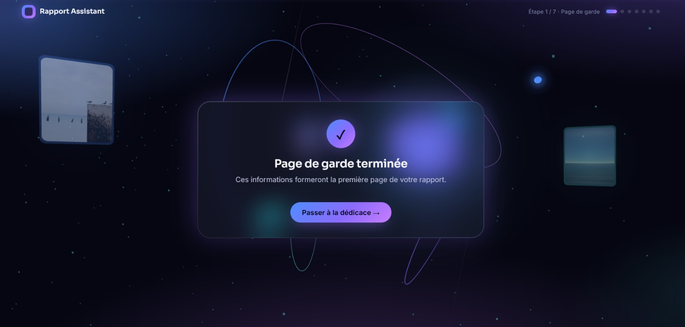
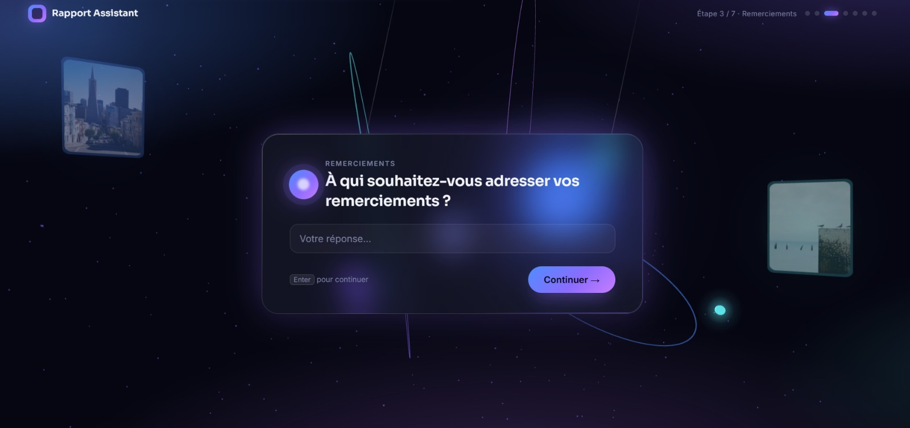
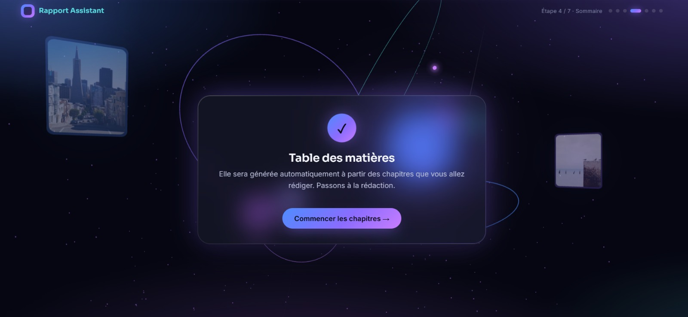
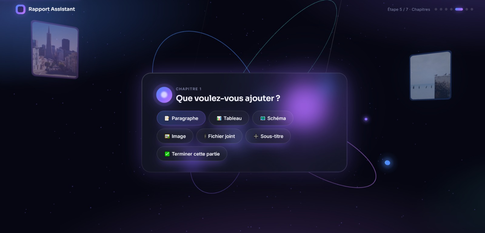
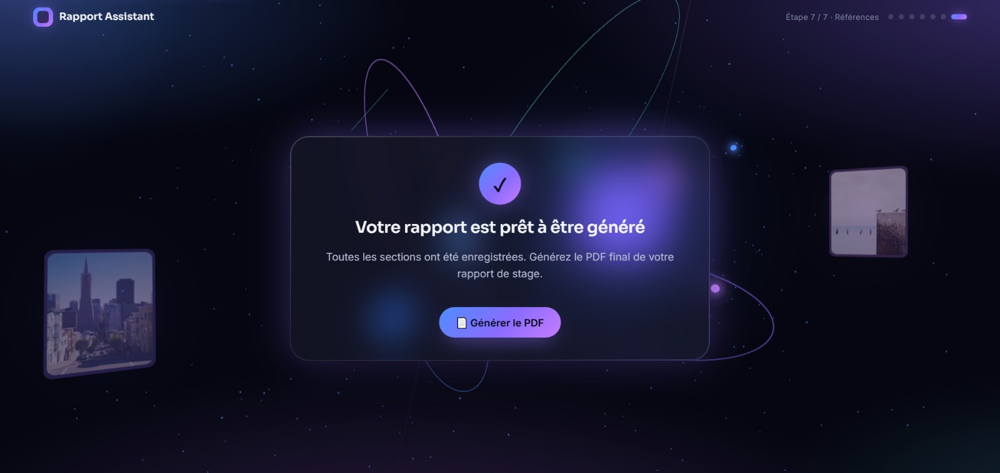
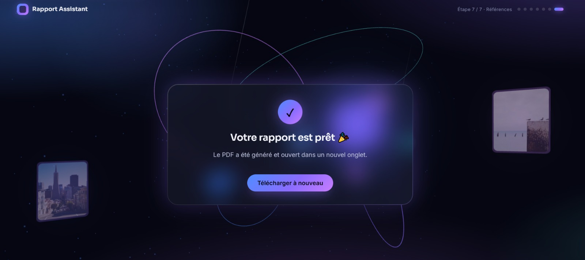

# 📄 Rapport Generator

Générateur assisté de rapports académiques (PFE / mémoires / rapports de stage). Un assistant conversationnel guide l'étudiant·e à travers chaque section du document — page de garde, dédicace, remerciements, chapitres, conclusion, références — puis génère automatiquement un **PDF** propre via **LaTeX**.

> 🎓 Pensé pour les étudiant·e·s qui doivent produire un rapport structuré (page de garde académique, sommaire, chapitres, bibliographie) sans écrire une seule ligne de LaTeX.

---

## 🎬 Démo


🎥 **Vidéo de démonstration :**

[](https://drive.google.com/drive/folders/1EufH6-02gw4_3GEB1S_hs9eLjPxSQEAT?usp=sharing)

*(clique sur l'image ci-dessus pour lancer la vidéo)*

🔑 **Compte de test** :
- Email : `belaidghizlane85@gmail.com`
- Mot de passe : `Ghizlane12345`

### Aperçu de l'assistant conversationnel









### 📄 Exemple de rapport généré

👉 [Ouvrir/télécharger le PDF d'exemple](screenshots/rapport-exemple/rapport.pdf)

---

## ✨ Fonctionnalités

- 🔐 Authentification (inscription / connexion) via Firebase
- 💬 Assistant pas-à-pas, question par question, pour remplir chaque section du rapport
- 📚 Chapitres structurés en arborescence : sections, sous-sections, sous-sous-sections illimitées
- 🖼️ Insertion réelle d'images, tableaux et schémas (upload de fichiers)
- 📎 Pièces jointes (annexes) référencées dans le document
- 🔗 Section « Références et Webographie » générée automatiquement, avec liens cliquables
- 💾 Sauvegarde progressive des réponses (aucune perte si l'utilisateur quitte en cours de route)
- 📄 Génération automatique du document en LaTeX → PDF, prêt à télécharger

---

## 🛠️ Stack technique

| Couche       | Technologie                       |
|--------------|------------------------------------|
| Frontend     | HTML / CSS / JavaScript vanilla    |
| Backend      | PHP                                 |
| Authentification | Firebase Auth                  |
| Génération PDF | Python + LaTeX (`xelatex`/`pdflatex`) |
| Stockage     | Fichiers JSON                      |
| Conteneurisation| Docker (image prête à l'emploi, testée en local)                 |

---

## 🗂️ Structure du projet

```
rapport-generator/
├── public/                        # Points d'entrée accessibles depuis le navigateur
│   ├── index.php                  # Connexion / inscription
│   ├── welcome.php
│   ├── assistant.php              # Page de garde
│   ├── assistant_dedicace.php
│   ├── assistant_remerciements.php
│   ├── assistant_tablematieres.php
│   ├── assistant_chapitre.php     # Chapitres (texte, tableaux, images, schémas, pièces jointes)
│   ├── assistant_conclusion.php
│   ├── assistant_references.php   # Références / webographie
│   └── logout.php
├── backend/                       # Logique serveur
│   ├── auth.php                   # Inscription / connexion (Firebase)
│   ├── firebase.php
│   ├── config.php                 # Configuration Firebase (lit la clé via env_loader.php)
│   ├── env_loader.php             # Charge le fichier .env (sans dépendance externe)
│   ├── user_paths.php             # Isole les données de chaque utilisateur (par UID Firebase)
│   ├── save_section.php           # Sauvegarde progressive des sections dans data.json
│   ├── upload_file.php            # Upload des images / fichiers joints
│   ├── build_pdf.php              # Déclenche la génération du PDF
│   ├── build_tex.py               # Construit le fichier .tex à partir de data.json et compile le PDF
│   ├── data.json.example          # Modèle de structure de données (référence)
│   └── users_data/                # 1 sous-dossier par utilisateur : data.json, uploads/, rapport.pdf
├── storage/
│   └── users.json.example         # Modèle de fichier utilisateurs (à copier)
├── assets/
│   ├── css/style.css
│   └── js/*.js                    # Moteur de questions (qflow.js) + logique de chaque assistant
├── screenshots/                    # Captures d'écran + PDF d'exemple (voir section Démo)
├── .env.example                    # Modèle de configuration (clé Firebase)
├── Dockerfile                      # Image prête à l'emploi (PHP + Python + LaTeX)                  
├── .gitignore
├── LICENSE
└── README.md
```

---

## 🔑 Variables d'environnement

| Variable | Description | Obligatoire |
|---|---|---|
| `FIREBASE_API_KEY` | Clé API Web du projet Firebase (Paramètres du projet > Général > Vos applications) | Oui |
| `PORT` | Port sur lequel Apache écoute (utile seulement si déployé sur une plateforme cloud) | Non (auto) |

- **En local** : copie `.env.example` en `.env` à la racine du projet, puis remplace la valeur par ta vraie clé Firebase. Ce fichier `.env` est ignoré par Git (voir `.gitignore`), il ne sera jamais commité.
  ```bash
  cp .env.example .env
  ```


---

## 🧠 Choix d'architecture

- **PHP + Python plutôt qu'un seul langage** : PHP gère l'authentification et l'API légère (pattern classique, rapide à déployer avec Apache) ; Python est utilisé spécifiquement pour piloter la compilation LaTeX (`subprocess`), car c'est l'écosystème le plus mature pour ça.
- **LaTeX plutôt qu'une librairie PDF classique (ex: FPDF, DomPDF)** : un rapport académique a des exigences typographiques précises (numérotation, table des matières, bibliographie) que LaTeX gère nativement et que les générateurs PDF "HTML → PDF" simulent mal.
- **Fichiers JSON plutôt qu'une base de données** : pas de base à provisionner pour un projet de cette taille (quelques utilisateurs, pas de requêtes complexes) — voir la Roadmap ci-dessous pour l'évolution prévue si le besoin grandit.
- **Isolation par dossier (`users_data/{uid}/`)** plutôt qu'un identifiant en base : simple, sans dépendance supplémentaire, et suffisant tant que le volume reste modeste.
- **Docker plutôt qu'une installation manuelle** : LaTeX et Python sont lourds à installer à la main ; l'image Docker rend le projet testable en une seule commande, sur n'importe quelle machine.

---

## 🔍 Défis techniques rencontrés & résolutions

Quelques problèmes concrets rencontrés pendant le développement, et comment ils ont été résolus :

| Problème | Cause | Solution |
|---|---|---|
| **Rapports partagés entre utilisateurs** | `data.json` et `rapport.pdf` étaient des fichiers uniques sur le serveur, écrasés à chaque génération | Chaque utilisateur (identifié par son UID Firebase) a désormais son propre dossier isolé : `backend/users_data/{uid}/` |
| **Compilation PDF qui plantait** | Les caractères spéciaux LaTeX (`%`, `&`, `_`, `#`) tapés dans un titre ou un paragraphe cassaient la compilation | Échappement systématique de tout le texte libre avant insertion dans le `.tex` (côté PHP/Python et JS) |
| **404 sur les appels API une fois déployé** | Le `Dockerfile` restreint Apache au dossier `public/`, mais le frontend appelle `backend/` et `assets/` en chemins relatifs | Ajout d'`Alias` Apache explicites pour rendre ces dossiers accessibles, tout en bloquant l'accès direct aux fichiers de données (`.json`, `.tex`) |
| **Faille XSS potentielle** | Un titre de chapitre tapé par l'utilisateur était inséré via `innerHTML`, permettant l'injection de code | Remplacement par `textContent` partout où du texte utilisateur est affiché |
| **Message d'erreur générique et inexploitable** | Un warning PHP (ex: LaTeX non installé) polluait la réponse JSON, provoquant une erreur réseau côté navigateur au lieu du vrai message | Suppression de l'affichage des warnings PHP dans les réponses JSON + affichage du détail réel de l'erreur côté frontend |
| **Clé API en clair dans le code** | La clé Firebase était écrite en dur dans `config.php`, risque de fuite si poussée sur Git | Migration vers des variables d'environnement (`.env` en local, dashboard Render en production) |

Cette approche itérative — tester, identifier la cause réelle, corriger à la racine plutôt que contourner le symptôme — reflète la méthodologie appliquée sur l'ensemble du projet.

---

## ⚙️ Prérequis (installation locale)

- PHP ≥ 7.4 avec un serveur (Apache, Nginx, ou le serveur intégré `php -S`)
- Python 3 (pour `build_tex.py`)
- Une distribution LaTeX installée (`pdflatex` ou `xelatex` accessible dans le `PATH`) — par exemple [TeX Live](https://www.tug.org/texlive/) ou [MiKTeX](https://miktex.org/)

## 🚀 Installation locale

1. **Cloner le dépôt**
   ```bash
   git clone https://github.com/<votre-utilisateur>/rapport-generator.git
   cd rapport-generator
   ```

2. **Créer le fichier utilisateurs local** (ignoré par Git — propre à chaque installation)
   ```bash
   cp storage/users.json.example storage/users.json
   ```
   *(`backend/data.json` n'existe plus : chaque utilisateur a désormais son propre dossier de données, créé automatiquement à la première utilisation — voir section Architecture ci-dessous.)*

3. **Configurer la clé Firebase**
   ```bash
   cp .env.example .env
   ```
   puis ouvrir `.env` et remplacer `VOTRE_FIREBASE_WEB_API_KEY` par ta vraie clé (voir [`backend/FIREBASE_SETUP.md`](backend/FIREBASE_SETUP.md) pour l'obtenir).

4. **Lancer le serveur PHP**
   ```bash
   php -S localhost:8000 -t public
   ```

5. Ouvrir [http://localhost:8000](http://localhost:8000) dans le navigateur.

> 💡 Pas envie d'installer LaTeX et Python à la main ? Utilise Docker (voir ci-dessous) — tout est déjà configuré dans l'image.

## 🐳 Lancer avec Docker (recommandé)

```bash
docker build -t rapport-generator .
docker run -p 8080:80 rapport-generator
```

Ouvrir [http://localhost:8080](http://localhost:8080).

## ☁️ Déploiement en ligne (Render)

Ce projet n'est pas déployé en ligne pour le moment. Les plateformes gratuites testées (Render, Koyeb, Google Cloud Run, Northflank) exigent désormais une carte bancaire à l'inscription, même pour leur offre gratuite — voir la Roadmap ci-dessous pour les pistes envisagées.
En attendant, le projet **est entièrement testable en local en une poignée de commandes** grâce à Docker (voir ci-dessus), et **une vidéo de démonstration**complète est disponible dans la section Démo en haut de ce document.


## 🧩 Architecture multi-utilisateurs

Chaque utilisateur connecté (identifié par son UID Firebase, unique et stable) a son **propre dossier isolé** :

```
backend/users_data/{uid}/
├── data.json      # réponses de CET utilisateur
├── uploads/        # images / fichiers joints de CET utilisateur
└── rapport.pdf     # PDF généré pour CET utilisateur
```

Ainsi, si plusieurs étudiant·e·s utilisent l'application en même temps (ex. démo devant un jury, plusieurs camarades qui testent), chacun génère et récupère **son propre rapport**, sans écraser celui des autres.

---

## 🔒 Sécurité

- Les mots de passe sont gérés par Firebase Authentication (jamais stockés en clair côté serveur).
- La clé Firebase n'est jamais écrite en dur dans le code : elle est lue via une variable d'environnement (`.env` en local, dashboard Render en production).
- Les données de chaque utilisateur sont isolées dans `backend/users_data/{uid}/` (voir Architecture ci-dessus) et **ne doivent jamais être commitées** (voir `.gitignore`).
- Les fichiers uploadés sont filtrés par extension et limités à 15 Mo.
- Pensez à définir des permissions d'écriture restreintes sur `backend/` et `storage/` en production.

---

## 📌 Roadmap / améliorations possibles

- [ ] Migrer le stockage JSON vers une vraie base de données (MySQL / SQLite)
- [ ] Ajouter une prévisualisation du rapport avant export
- [ ] Ajouter des tests automatisés
- [ ] Support multi-étudiants sur la page de garde (projets de groupe)

---

## 👩‍💻 Auteur

Développé par **Ghizlane Belaid** — étudiante en Génie Informatique, École Nationale des Sciences Appliquées d'Oujda (ENSAO).

## 📄 Licence

Ce projet est distribué sous licence MIT — voir le fichier [LICENSE](LICENSE).
